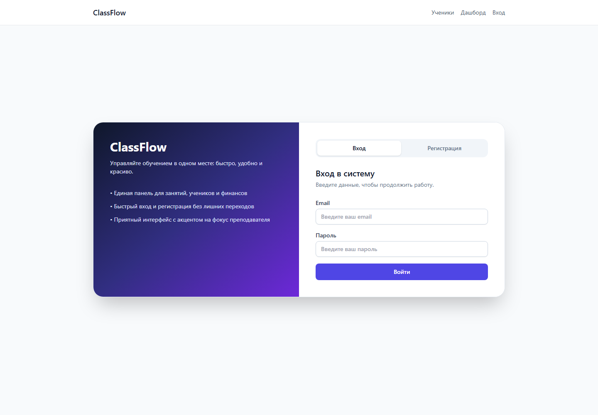

# ClassFlow

> MVP-платформа для репетиторов: ученики, занятия, домашние задания и учёт оплат.

**ClassFlow** помогает собрать повседневную работу репетитора в одном месте: вести учеников, планировать занятия и видеть ближайшие задачи.

## Возможности MVP

- Карточки учеников и расписание занятий
- Статусы занятий и отметки об оплате
- Домашние задания
- Дашборд ближайших занятий

## Стек

| Часть | Технологии |
| --- | --- |
| Backend | FastAPI, SQLAlchemy, Alembic |
| Frontend | Next.js App Router, Tailwind CSS, shadcn/ui |
| Данные | PostgreSQL |
| Запуск | Docker Compose |

## Быстрый запуск

Нужен установленный Docker с поддержкой Docker Compose.

```bash
cp .env.example .env
docker compose up --build
```

После запуска:

- Frontend: <http://localhost:3000>
- API и Swagger: <http://localhost:8000/docs>

## Переменные окружения

Заполни значения в `.env` на основе `.env.example`:

| Переменная | Назначение |
| --- | --- |
| `DATABASE_URL` | Подключение к PostgreSQL |
| `JWT_SECRET` | Секрет для JWT |
| `FRONTEND_ORIGIN` | Адрес frontend для CORS |
| `TAX_PERCENT_DEFAULT` | Значение налога или комиссии по умолчанию |
| `NEXT_PUBLIC_API_URL` | Адрес backend для frontend |

## Проверки

Backend-команды выполняются в контейнере `backend`:

```bash
pytest
ruff check .
mypy app
```

Frontend:

```bash
npm run lint
npm run typecheck
```

## Структура проекта

```text
backend/  FastAPI, SQLAlchemy и Alembic
frontend/ Next.js-интерфейс
infra/    заметки по инфраструктуре
docs/     спецификация и описание API
```

## Документация

- [Спецификация](docs/SPEC.md)
- [API](docs/API.md)

## Статус

Проект находится на стадии MVP. Для простоты токен авторизации сейчас хранится в `localStorage`; перед production-развёртыванием стоит перейти на более безопасную схему хранения, например `httpOnly` cookie.

## Скриншот интерфейса

Экран входа в приложение:


